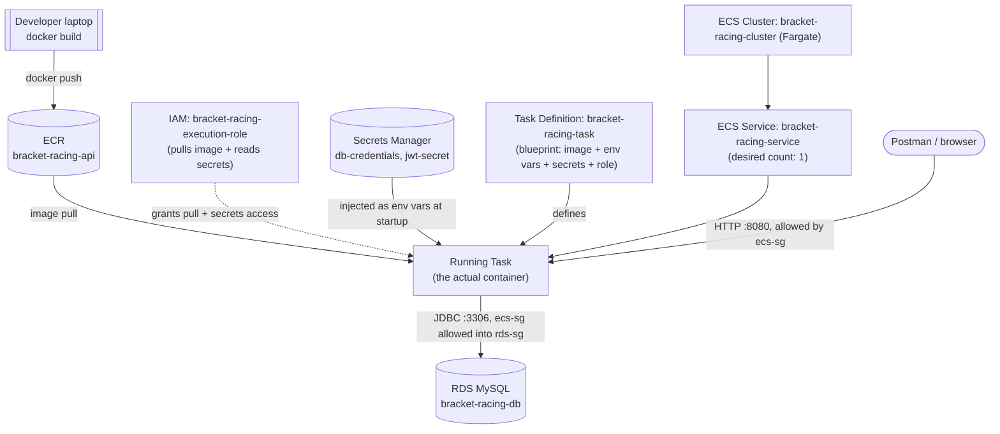

# Deploying BracketRacingAPI to AWS (ECS Fargate + RDS)

A step-by-step record of how this project got deployed, so it can be repeated
or torn down and rebuilt without re-deriving everything from scratch. Console
(UI) steps are used wherever possible; a few one-time setup actions only have
a CLI path and are marked as such.

**Region used throughout: `us-east-2` (Ohio).** Every resource below must be
in the same region — AWS services generally can't reference each other across
regions, and mismatched regions was the first real mistake made during this
deployment (see Troubleshooting at the end).

## Architecture



## Phase 1 — AWS account + CLI

1. Create an AWS account (root). Do not use root day-to-day.
2. `IAM → Users → Create user` — created `schuberth-user` with **AdministratorAccess**
   attached directly. (Fine for a personal sandbox account; would be scoped
   down in a real org — see concepts doc.)
3. Generate an access key for that user: `IAM → Users → schuberth-user →
   Security credentials → Create access key → Command Line Interface (CLI)`.
   Copy both values immediately (secret is shown once).
4. Locally: `aws configure` → paste in the Access Key ID / Secret Access Key,
   region `us-east-2`, default output format.
5. Verify: `aws sts get-caller-identity` should print the account id and the
   `schuberth-user` ARN.

## Phase 2 — ECR (container registry)

Console: search **ECR** → make sure the region dropdown (top-right) says
`US East (Ohio) / us-east-2` → **Create repository** → name `bracket-racing-api`.

Pushing the image still needs the CLI/Docker (no UI way to push a local
image):
```bash
aws ecr get-login-password --region us-east-2 | docker login --username AWS --password-stdin <account-id>.dkr.ecr.us-east-2.amazonaws.com

cd "BracketRacingAPI"
docker build -t bracket-racing-api .
docker tag bracket-racing-api:latest <account-id>.dkr.ecr.us-east-2.amazonaws.com/bracket-racing-api:latest
docker push <account-id>.dkr.ecr.us-east-2.amazonaws.com/bracket-racing-api:latest
```
Confirm in the ECR console: the repository should show one image tagged `latest`.

## Phase 3 — RDS (database)

1. `RDS → Create database`
2. Engine: **MySQL**
3. Template: **Free tier**
4. DB instance identifier: `bracket-racing-db`
5. Master username: `admin`, generate and save a master password
6. Instance class: `db.t4g.micro` (free tier default)
7. **Public access: No** — the app reaches this over the private network
   inside the VPC, it never needs to be open to the internet
8. VPC security group: **create new**, name it `rds-sg`
9. Create database, wait for status **Available**
10. Note the **endpoint** (hostname) from the instance's detail page — looks
    like `<db-identifier>.<random-id>.us-east-2.rds.amazonaws.com`

**One-time gotcha:** leaving "Initial database name" blank at creation means
no schema exists yet — `spring.jpa.hibernate.ddl-auto=update` only creates
*tables* inside an existing schema, not the schema itself. Creating the schema
without opening RDS to the public internet:

1. Open **CloudShell** (icon in the console's top nav bar)
2. Create a **VPC environment** for it: same VPC as RDS, any subnet, security
   group = `ecs-sg` (created in Phase 5 — do this step after Phase 5 if doing
   it fresh, or reuse `ecs-sg` since it's already allowed into `rds-sg`)
3. `sudo dnf install -y mariadb105`
4. `mysql -h <rds-endpoint> -P 3306 -u admin -p`
5. `CREATE DATABASE bracket_racing_db;` then `exit;`

This keeps "Public access: No" true the entire time — CloudShell's VPC
environment reaches RDS over the private network, same path ECS uses later.

## Phase 4 — Secrets Manager

1. `Secrets Manager → Store a new secret`
2. Type: **Credentials for Amazon RDS database** → select `bracket-racing-db`
   → this auto-populates `username`, `password`, `host`, `port`,
   `dbInstanceIdentifier` as one JSON object → name it
   `bracket-racing/db-credentials`
3. `Store a new secret` again → type **Other type of secret** → key/value:
   `JWT_SECRET` = output of `openssl rand -base64 64` → name it
   `bracket-racing/jwt-secret`
4. Note both secrets' **ARNs** (shown on each secret's detail page) — needed
   in Phase 5.

## Phase 5 — ECS (runs the container)

### 5a. Execution role
`IAM → Roles → Create role → AWS service → Elastic Container Service →
Elastic Container Service Task` → name it `bracket-racing-execution-role`.

Attach **two** separate things to this one role (they cover different jobs —
see concepts doc):
- Managed policy: `AmazonECSTaskExecutionRolePolicy` (pull from ECR, write to
  CloudWatch logs)
- Inline policy (written by hand, scoped to just the two secrets):
```json
{
  "Version": "2012-10-17",
  "Statement": [
    {
      "Effect": "Allow",
      "Action": "secretsmanager:GetSecretValue",
      "Resource": [
        "arn:aws:secretsmanager:us-east-2:<account-id>:secret:bracket-racing/db-credentials-XXXXXX",
        "arn:aws:secretsmanager:us-east-2:<account-id>:secret:bracket-racing/jwt-secret-XXXXXX"
      ]
    }
  ]
}
```

### 5b. Security groups
`EC2 → Security Groups → Create security group`:
- **`ecs-sg`**: inbound Custom TCP 8080 from `0.0.0.0/0` (anywhere) — this is
  what makes the API reachable from the internet without a load balancer
- **`rds-sg`** (already exists from Phase 3): edit inbound rules — remove any
  CIDR/IP-based rule, add a fresh rule: type `MYSQL/Aurora` (port 3306),
  source = the **`ecs-sg`** security group itself (not an IP). Only things
  wearing `ecs-sg` can reach the database.

### 5c. Cluster
`ECS → Clusters → Create cluster` → name `bracket-racing-cluster` →
infrastructure: **AWS Fargate (serverless)**.

### 5d. Task definition
`ECS → Task definitions → Create new task definition`:
- Family: `bracket-racing-task`
- Launch type: `AWS Fargate`
- Task size: `0.5 vCPU` / `1 GB` (plenty, keeps cost near zero)
- Task role: **None** (the app itself calls no AWS APIs)
- Task execution role: `bracket-racing-execution-role`
- Container:
  - Name: `bracket-racing-api`
  - Image URI: `<account-id>.dkr.ecr.us-east-2.amazonaws.com/bracket-racing-api:latest`
  - Port: `8080` TCP
  - Plain environment variables:
    - `SPRING_PROFILES_ACTIVE` = `aws`
    - `DB_URL` = `jdbc:mysql://<rds-endpoint>:3306/bracket_racing_db`
  - Secrets-Manager-sourced environment variables (**must be the full ARN +
    `:key::` suffix — see Troubleshooting below**):
    - `DB_USER` ← `arn:aws:secretsmanager:us-east-2:<account-id>:secret:bracket-racing/db-credentials-XXXXXX:username::`
    - `DB_PASSWORD` ← `...:bracket-racing/db-credentials-XXXXXX:password::`
    - `JWT_SECRET` ← `...:bracket-racing/jwt-secret-XXXXXX:JWT_SECRET::`
- Logging: leave default (auto-creates a CloudWatch log group — this is the
  first place to look if a task fails to start)

### 5e. Service
`bracket-racing-cluster → Services tab → Create`:
- Launch type: `FARGATE`
- Task definition: `bracket-racing-task` (latest revision)
- Service name: `bracket-racing-service`
- Desired tasks: `1`
- Networking: default VPC, public subnets, security group = `ecs-sg`
  (switch from "create new" to "use existing"), **Public IP: Turned on**
- Load balancing: none (adds cost/complexity not needed for a demo)

## Phase 6 — Verify

1. `bracket-racing-cluster → Tasks tab → click the running task → Network`
   → note the **Public IP**
2. Postman: point `baseUrl` at `http://<public-ip>:8080`, run
   `POST /api/auth/register` — a token back means the whole chain works
   (container started → connected to RDS → read JWT_SECRET from Secrets
   Manager → reachable from the internet).
3. If a task fails to start, check `Tasks → [task] → Logs` (CloudWatch)
   first — it's where the real Spring Boot stack trace shows up.

**Known limitation:** without a load balancer, the public IP changes if the
task ever restarts. Fine for demoing; an Application Load Balancer + a fixed
DNS name would be the next step for a stable URL.

## Troubleshooting log (mistakes actually made, kept for next time)

- **Region mismatch**: ECR was created in `us-east-1` while RDS/Secrets
  Manager were created in `us-east-2`. AWS resources can't reach across
  regions implicitly — everything had to be recreated/verified in the same
  region. *Lesson: pick a region before creating anything, and double check
  the region dropdown on every service's console page.*
- **Editing a CIDR rule into a security-group-reference rule fails**: AWS
  error `"You may not specify a referenced group id for an existing IPv4 CIDR
  rule"`. A rule's type (CIDR vs. security-group-reference) can't be changed
  in place — delete the old rule and add a brand new one instead.
- **RDS "Public access: No" blocks even security-group-permitted traffic**:
  a security group only decides *who* can reach a resource *if* it's
  reachable at all. "Public access: No" means no public network path exists,
  independent of security group rules. Needed CloudShell's VPC environment
  (or a temporary public-access flip) to run one-off SQL against it.
- **`valueFrom` with just a key name resolves as SSM Parameter Store, not
  Secrets Manager**: task failed with `AccessDeniedException ... ssm:GetParameters
  on resource arn:aws:ssm:.../parameter/username`. ECS treats a bare string in
  a secret's "Value from" field as an SSM parameter name; it only uses
  Secrets Manager when given the **full ARN** (`arn:aws:secretsmanager:...:secret-name:jsonkey::`).

## Not done yet (next steps)

- **GitHub Actions CI/CD**: `maven.yml` currently only runs `mvn verify`. Next
  step is a `deploy` job that builds the image, pushes to ECR, and calls
  `aws ecs update-service --force-new-deployment` after tests pass, so a push
  to `main` redeploys automatically.
- **Load balancer + stable DNS** if a permanent URL is wanted for the resume/README.
